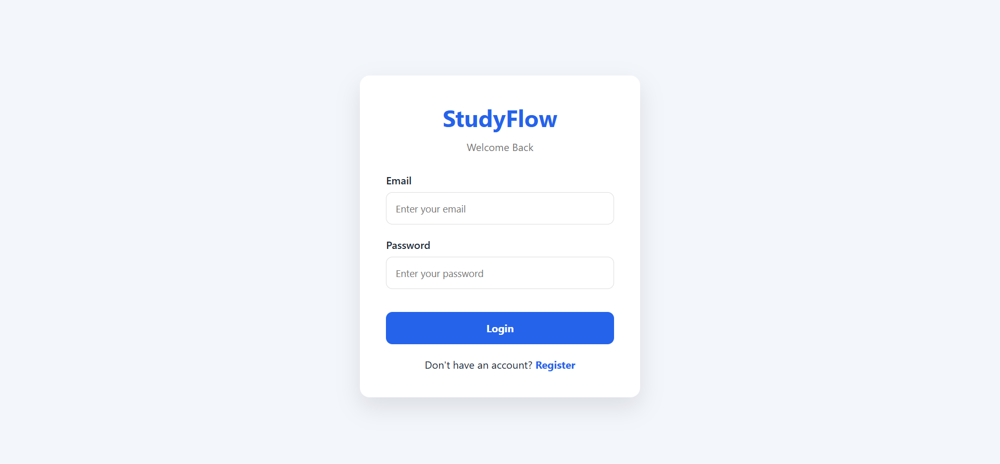
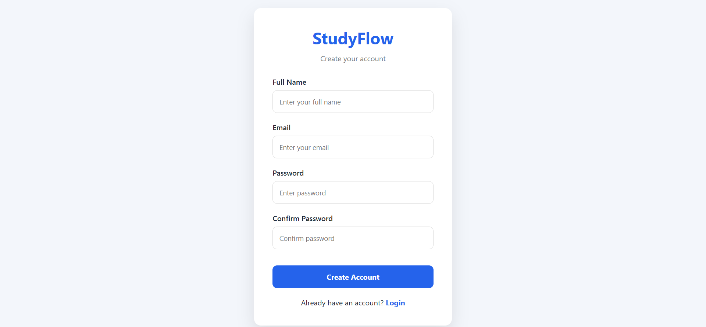
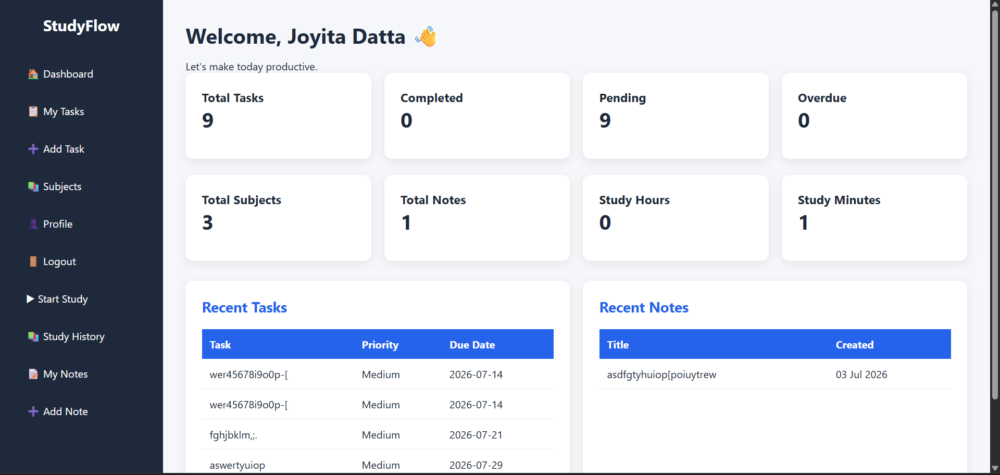
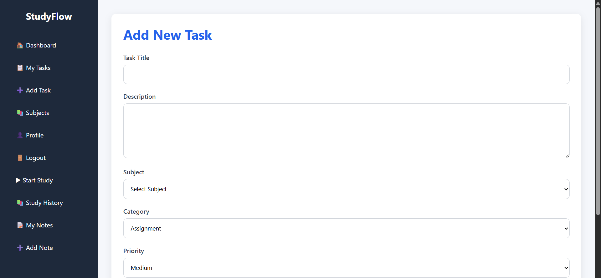
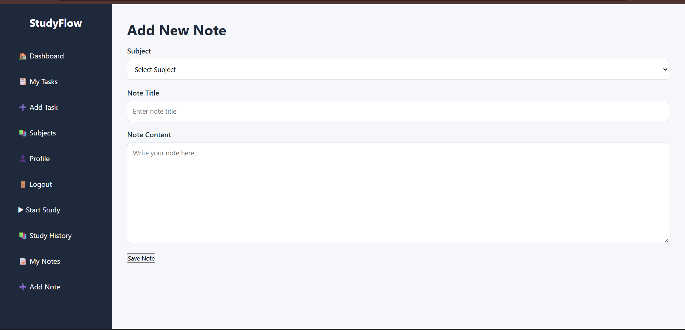
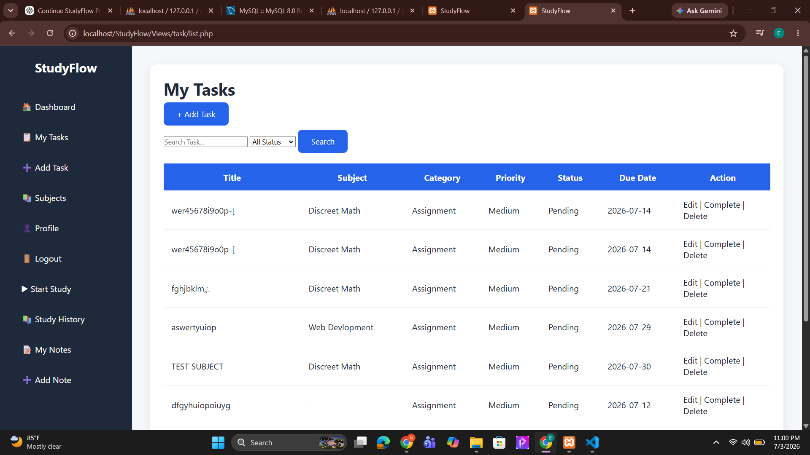
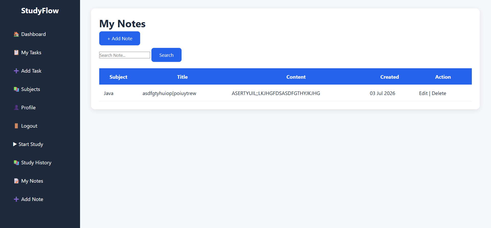
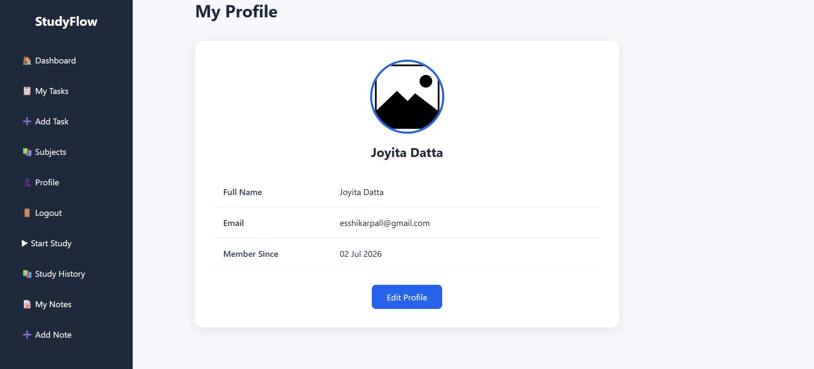

# 📚 StudyFlow - Student Productivity Management System

StudyFlow is a web-based Student Productivity Management System developed using PHP, MySQL, HTML and CSS following the MVC architecture. It helps students organize their academic work by managing tasks, subjects, notes, and study sessions in one place.

---

## 🚀 Features

- User Registration & Login
- Secure Password Hashing
- Session-based Authentication
- Dashboard with Statistics
- Subject Management (CRUD)
- Task Management (CRUD)
- Notes Management (CRUD)
- Study Session Tracker
- User Profile Management
- Landing Page
- Responsive User Interface
- MySQL Database Integration

---

## 🛠️ Technologies Used

- PHP
- MySQL
- HTML5
- CSS3
- MVC Architecture
- XAMPP

---

## 📂 Project Structure

```
StudyFlow/
│
├── Assets/
├── Config/
├── Controllers/
├── Database/
├── Includes/
├── Models/
├── Views/
├── index.php
└── README.md
```

---

## ⚙️ Installation

1. Clone the repository

```
git clone https://github.com/EEEshika/StudyFlow.git
```

2. Copy the project into:

```
xampp/htdocs/
```

3. Import

```
Database/studyflow_db.sql
```

using phpMyAdmin.

4. Update database credentials in

```
Config/database.php
```

5. Start Apache & MySQL.

6. Open

```
http://localhost/StudyFlow/
```

---

## 📸 Screenshots

### Landing Page


### Login



### Register



### Dashboard



### Add Task



### Add Note



### My Tasks



### Notes



### Profile



---

## 🔮 Future Improvements

- Profile Picture Upload
- Dark Mode
- Calendar Integration
- Email Notifications

---

## 👨‍💻 Author

Eshika Rani Pall

GitHub:
https://github.com/EEEshika

